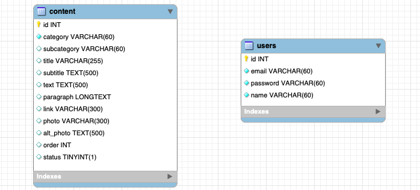

# Sistema Base Para Sites Visão

## __Instalação__
### __Requisitos__
> 1. Possuir o Node.js instalado. [Link](https://nodejs.org/pt-br/) para instalação
> 
> 2. Instalação do Yarn - Outro gerenciador de pacote do Node (recomendado) | [Link](https://yarnpkg.com/lang/pt-br/docs/install/#windows-stable)
>
> 4. Estar com o SGBD ligado [MySql versão >= 5.6]


Na pasta raiz do projeto, execute: 

1. Instalar os pacotes do node 
```js 
    npm install
```
ou
```js 
    yarn i
```

### __Configuração__
1. #### Renomeie o arquivo .config.ini.example para .config.ini
    * Arquivo localizado na pasta _admin/_
> Até aqui temos seu banco de dados configurado e os pacotes node instalados
2. #### Em seu navegador, execute o _admin/config/setup.php_, exemplo:
    * _localhost:3000/admin/config/setup.php_
### ! Nota Importante

> Caso o projeto já tenha sido configurado, apenas o arquivo config.ini deve ser alterado com as seguintes informações
```ini
HOST_DB={{ seu host }} #localhost
PASS_DB={{ senha bd }}
USER_DB={{ user  bd }}
PORT_DB={{ porta bd }}
```


### __Banco de dados__

> O script de criação do banco de dados deve ser incluido na pasta [___docs/scripts/___](docs/scripts/)
> 
> Renomeie o arquivo para ___estrutura.sql___
> 
> Não se preoculpe se o script não é o modelo final, podemos alterar depois
>
> * #### _Existe um modelo de script genérico para sites já na pasta_
> 
> 
>   
> * ##### O modelo é suficiente para a maioria dos sites que são feitos pela Visão, mas pode gerar muitas células NULL.

### **! Nota Importante :**
> * Caso queira utilizar um modelo próprio, para manutenção das funções de Login, deve existir uma tabela ___users___ modelada pelo menos com os mesmos atributos do modelo acima
>
> * Para facilitar o desenvolvimento, inclua o script de inserção abaixo caso não utilize o modelo.
```sql
INSERT INTO `users`(`email`, `password`, `name`) VALUES ('admin@visaojr.com.br', '8d58defd03e08831be110619ca62fbdb2851219d', 'Visão Admin');
```

> Conforme o manual de projetos o padrão para desenvolvimento é
> 
> Email : admin@visaojr.com.br
> 
> Senha : Vis@o123


Para a inicializacao do banco de dados vamos utilizar o npm.

No seu prompt de comando, na pasta raiz :
```js
npm run create-schema
```
> Pronto, após a mensagem de sucesso no seu console, o banco de dados está configurado no ambiente
___
## O que eu possuo ?

Agora que a instalação está pronta, vamos ver um pouco do que eu possuo:
* Sou uma área adminsitrativa baseada em um template. Meu pai : [Admin **LTE**](https://adminlte.io)
* Graças a algumas modificações, aceito todas as classes do **Bootstrap 4**
* Algumas coisas em mim já estão prontas para você não ter que se preoculpar:
  * Página de Login
  * Página de Edição de Usuário
  * Menu Principal
  * Reset de Senhas [Com envio de email]
  * Troca de Favicon
  * Não Precisa se preoculpar com a segurança, se seguir tudo direitinho, vai dar bom!
> Tenho alguns modelos também que você vai amar :smirk:
>
>[___admin/pages/___](admin/pages/)
>
> Se achou que acabou, temos mais :scream: :
  * Algumas "baterias" estão incluidas, tudo para que a codificação seja a mais simpels possível:
  
    * Módulo de Upload de Imagem
    * Módulo de redimencionamento de Imagem
    * Módudo de Upload de Arquivos
    * Módulo de Cortar Imagem
    * Módulo Envio de Emails
    * Módulo de Escrita de Emails

### **Bibliotecas JavaScript já carregadas :**
1. [Chart.js](https://www.chartjs.org) | [Exemplo](admin/pages/chart.md)
2. [FullCalendar](http://fullcalendar.io/) | [Exemplo](admin/pages/calendar.md)
3. [Select2.js](https://select2.org) | [Exemplo](admin/pages/inputs.md)
4. [TimePicker](https://jdewit.github.io/bootstrap-timepicker/) | [Exemplo](admin/pages/inputs.md)
5. [DatePicker](https://bootstrap-datepicker.readthedocs.io/en/latest/) | [Exemplo](admin/pages/inputs.md)
6. [DateRangePicker](http://www.daterangepicker.com) | [Exemplo](admin/pages/inputs.md)
7. [ColorPicker](https://github.com/farbelous/bootstrap-colorpicker) | [Exemplo](admin/pages/inputs.md)
8. [iCheck](http://icheck.fronteed.com) | [Exemplo](admin/pages/forms.md)
9. [CKEditor](https://ckeditor.com) | [Exemplo](admin/pages/ckeditor.md)
10. [CKFinder](https://ckeditor.com/ckfinder/) | [Exemplo](admin/pages/ckfinder.md)